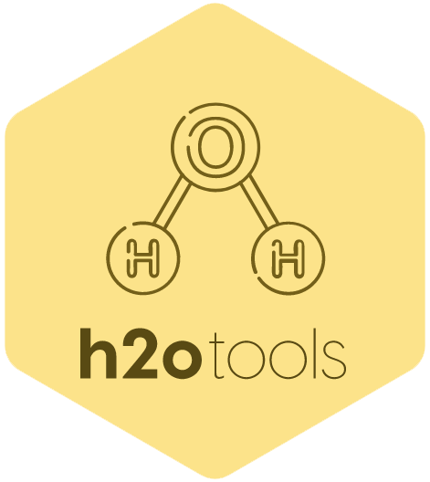

<a href="https://github.com/haghish/h2otools"></a>

`h2otools`: Machine Learning Model Evaluation for 'h2o' Package
===============================================================

[](https://cran.r-project.org/package=h2otools)  [](https://cran.r-project.org/package=h2otools) [](https://CRAN.R-project.org/package=h2otools)


Model evaluation 
----------------

There are plenty of procedures for evaluating machine learning models, many of which are not implemented in [`h2o`](https://CRAN.R-project.org/package=h2o) platform. This repository provides additional functions for model performance evaluation that are not implemented in `h2o`. 

> The `bootperformance` function evaluates the model for `n` number of bootstrapped samples from the testing dataset, instead of evaluating the model on the testing dataset once. Therefore, evaluating the confidence interval of the model performance. 

These functions are briefly described below:

Function           | Description
------------------ | -----------
`automlModelParam` | for extracting model parameters from AutoML grid
`bootperformance`  | Bootstrap performance evaluation
`Fmeasure`         | for evaluating `F3`, `F4`, `F5`, or any _beta_ value. `h2o` only provides `F0.5`, `F1`, and `F2`
`getPerfMatrix`    | retrieve performance matrix for all thresholds 
`kappa`            | Calculates kappa for all thresholds
`performance`      | provides performance measures (AUC, AUCPR, MCC, Kappa, etc.) using objects from h2o package 

Additional functions
--------------------

There are plenty of procedures for evaluating machine learning models, many of which are not implemented in [`h2o`](https://CRAN.R-project.org/package=h2o) platform. This repository provides additional functions for model performance evaluation that are not implemented in `h2o`. 

> The `bootperformance` function evaluates the model for `n` number of bootstrapped samples from the testing dataset, instead of evaluating the model on the testing dataset once. Therefore, evaluating the confidence interval of the model performance. 

These functions are briefly described below:

Function           | Description
------------------ | -----------
`checkFrame`       | Checks data.frame format, which is useful before uploading it to H2O cloud
`h2o.get_ids`      | Extracts model IDs from h2o AutoML and Grids nd returns a vector of model IDs 


Installation
------------

You can install the latest stable package from CRAN:

``` r
install.packages("h2otools")
```
